# Primer clase Modelación Numérica

- Objetivo: Resolución de problemas matemáticos de mayor complejidad (principios fisicos aplicados a problemas matematicos que intentan modelar la realidad lo mejor posible)

- Ejemplo
    Cuál es la realción entre el angulo tita y W

    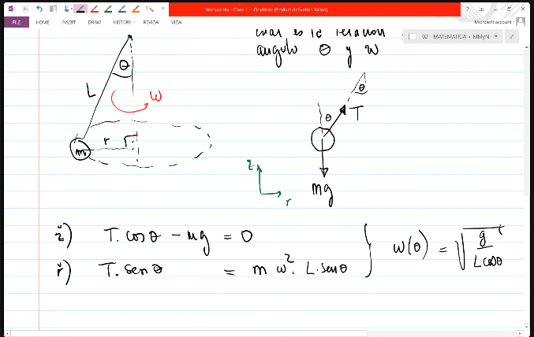
- Ejemplo 2
    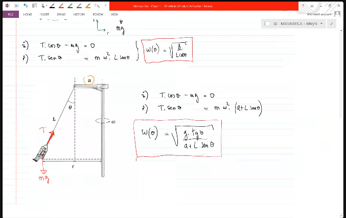

### Ecuaciones no Lineales

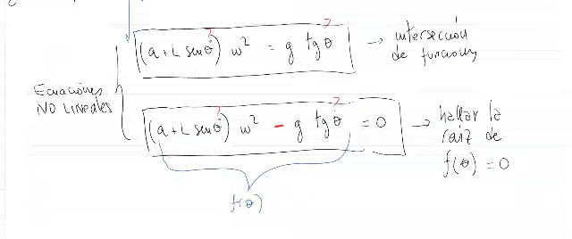

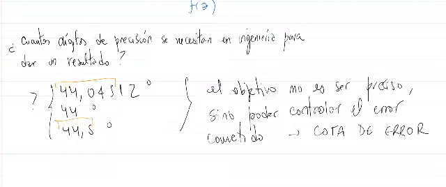

#### Modos para resolver ecuaciones no lineales
- **Metodo de Bisección**: Buscar la raíz exacta proponiendo un intervalo a0,b0
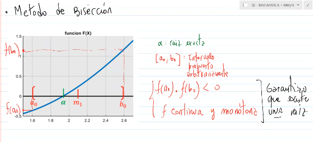
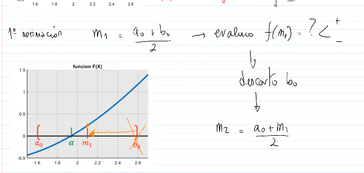
Debido a que eventualmente el metodo tendra un stop la solucion sera aproximado: Va a llamarse la cota de error de truncamiento.
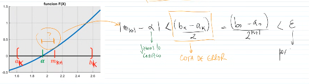

$n \geq \log_2\left(\frac{b_0 - a_0}{\varepsilon}\right) = \log_2\left(\frac{2.6 - 1.5}{0.02}\right) = \log_2(55) \approx 5.78$

Por lo tanto, se necesitan aproximadamente **6 iteraciones** para alcanzar la precisión deseada.

- **Metodo de Regula Falsi(Posición Falsa)**: Se calcula la raiz de la recta secante

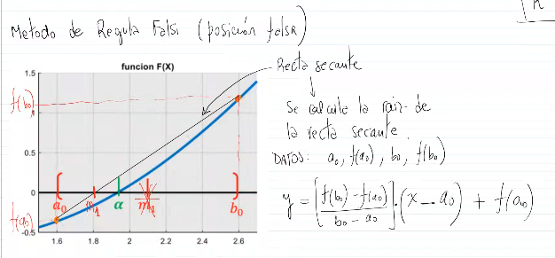

- **Metodo de Newton-Raphson**: Se calcula la raiz de la tangente

$$x_{nr} = x_n - \frac{f(x_n)}{f'(x_n)}$$

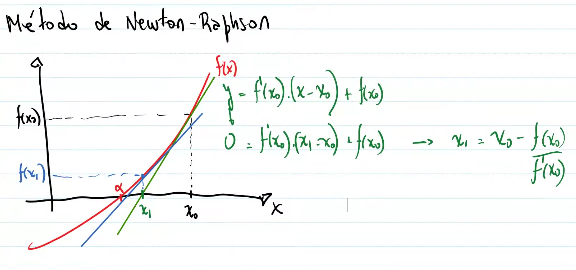

$$x_{n+1} = x_n - \frac{f(x_n)}{f'(x_n)}$$
Condicioness que garantizan la convergencia:

- la parte de debajo de la fracción debe ser diferente de 0, es decir, $f'(x_n) \neq 0$.
- la derivada segunda $f''(x)$ debe conservar el mismo signo en el intervalo considerado, es decir, $f''(x) > 0$ o $f''(x) < 0$ para todo $x$ en el intervalo.
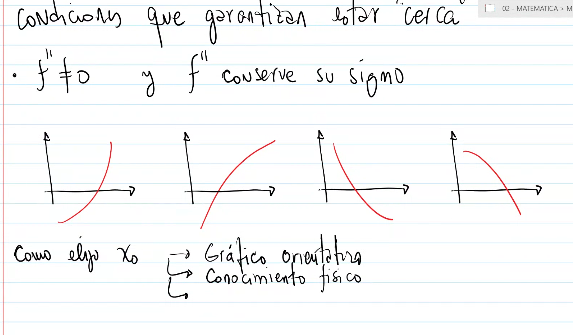

Ejemplo:
Encontrar la raíz de $f(x) = e^{-x} - x$ usando Newton-Raphson con $x_0 = 0.5$.

**Derivada:** $f'(x) = -e^{-x} - 1$

| $n$ | $x_n$ | $f(x_n)$ | $f'(x_n)$ | $x_{n+1}$ | Error |
|-----|-------|----------|-----------|-----------|-------|
| 0 | 0.50000 | 0.10653 | −1.60653 | 0.56631 | — |
| 1 | 0.56631 | 0.00347 | −1.56765 | 0.56714 | 0.147% |
| 2 | 0.56714 | 0.00001 | −1.56714 | **0.56714** | **0.002%** |

Raíz aproximada: $x_r \approx 0.56714$

- **Metodo de Punto Fijo**: Se reescribe la ecuación $f(x) = 0$ en la forma $x = g(x)$ y se itera:
$$x_{n+1} = g(x_n)$$
Ejemplo:
$f(x) = e^{-x} - x$ → $x = e^{-x}$ → $g(x) = e^{-x}$
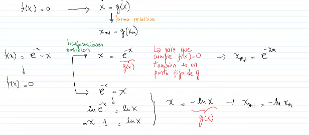

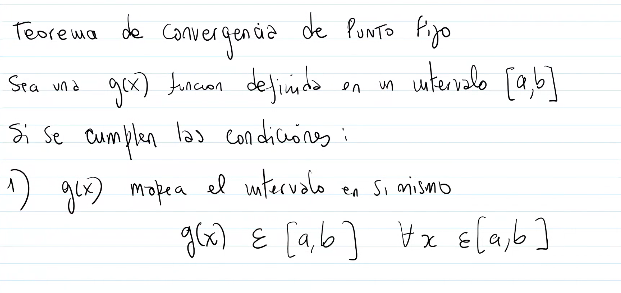

Condiciones de convergencia para el Método de Punto Fijo:

- La función $g(x)$ debe ser continua en el intervalo $[a, b]$.
- Se debe cumplir que $|g'(x)| < 1$ para todo $x$ en el intervalo considerado. Esta es la **condición suficiente de convergencia**.
- Si $|g'(x_n)| < 1$ en la vecindad de la raíz, el método converge.
- Si $|g'(x)| > 1$, el método diverge.

Para el ejemplo $g(x) = e^{-x}$:
$$g'(x) = -e^{-x}$$

En $x \approx 0.567$: $|g'(0.567)| = e^{-0.567} \approx 0.567 < 1$ ✓

Por lo tanto, el método converge.
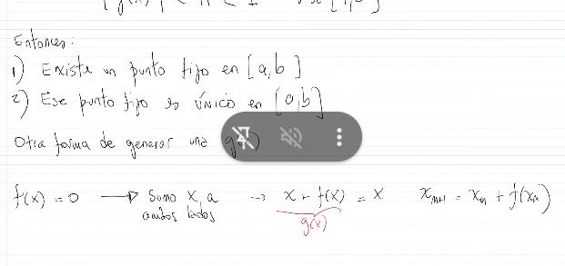
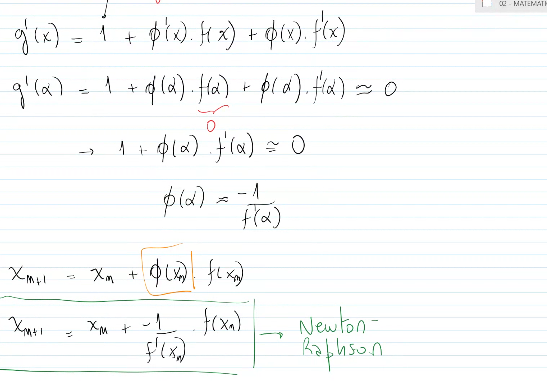

## Práctica

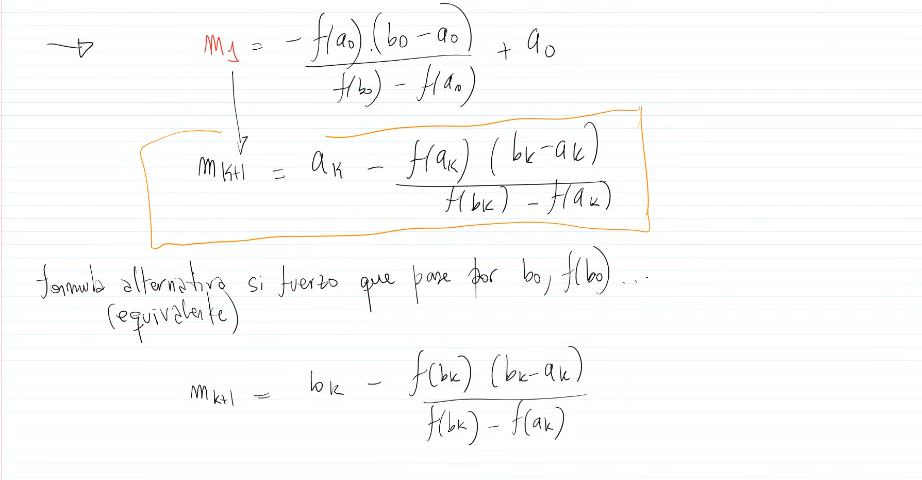

- **Ejercicio 1**

El metodo utilizado es Bisección
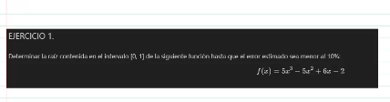

**Función:** $f(x)=5x^{3}-5x^{2}+6x-2$, intervalo inicial $[0,1]$.

**Se usa el error estimado relativo porcentual:**

$$E_a(\%)=\left|\frac{m_k-m_{k-1}}{m_k}\right|\cdot 100$$

| k | a_k | b_k | m_k = (a_k+b_k)/2 | f(m_k) | E_a (%) |
|---|-----|-----|--------------------|--------|---------|
| 1 | 0.00000 | 1.00000 | 0.50000 | 0.37500 | - |
| 2 | 0.00000 | 0.50000 | 0.25000 | -0.73438 | 100.000 |
| 3 | 0.25000 | 0.50000 | 0.37500 | -0.18945 | 33.333 |
| 4 | 0.37500 | 0.50000 | 0.43750 | 0.08667 | 14.286 |
| 5 | 0.37500 | 0.43750 | 0.40625 | -0.05246 | 7.692 |

Como en la iteracion 5 se cumple `E_a < 10%`, se detiene.
Raiz aproximada: `x_r ~ 0.40625`.

- **tabla del profe**

| $x_a$ | $x_m$ | $x_b$ | $f(x_a) \cdot f(x_m)$ | $f(x_b) \cdot f(x_m)$ | $\varepsilon$ |
|:------:|:------:|:------:|:---------------------:|:---------------------:|:-------------:|
| 0 | 0.5 | 1 | $< 0$ | $> 0$ | — |
| 0 | 0.25 | 0.5 | $> 0$ | $< 0$ | 100% |
| 0.25 | 0.375 | 0.5 | $> 0$ | $< 0$ | 33.3% |
| 0.375 | 0.4375 | 0.5 | $-0.0164 < 0$ | $> 0$ | 14.3% |
| 0.375 | **0.40625** | 0.4375 | $0.009 > 0$ | $-0.0045 < 0$ | 7.7% |

$x_m = 0.40625$

- **Ejercicio 2**
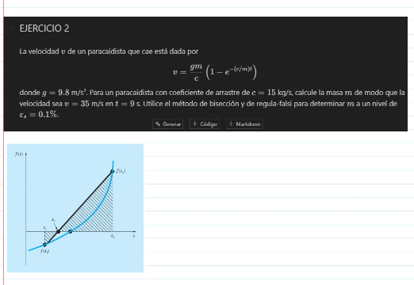

**Datos:** $g = 9.8\ \text{m/s}^2$, $c = 15\ \text{kg/s}$, $v = 35\ \text{m/s}$, $t = 9\ \text{s}$

Encontrar $m$ tal que:

$$f(m) = \frac{9.8\, m}{15}\left(1 - e^{-\frac{15\cdot 9}{m}}\right) - 35 = \frac{9.8\, m}{15}\left(1 - e^{-\frac{135}{m}}\right) - 35 = 0$$

Intervalo inicial: $f(50) \approx -4.53 < 0$, $f(100) \approx 13.40 > 0$ → $[50,\ 100]$

#### Bisección — $\varepsilon_a = 0.1\%$

| $k$ | $a_k$ | $b_k$ | $m_k$ | $f(m_k)$ | $\varepsilon_a$ (%) |
|:---:|:------:|:------:|:------:|:---------:|:-------------------:|
| 1 | 50.000 | 100.000 | 75.000 | 5.900 | — |
| 2 | 50.000 | 75.000 | 62.500 | 1.127 | 20.00 |
| 3 | 50.000 | 62.500 | 56.250 | −1.584 | 11.11 |
| 4 | 56.250 | 62.500 | 59.375 | −0.214 | 5.26 |
| 5 | 59.375 | 62.500 | 60.938 | 0.471 | 2.56 |
| 6 | 59.375 | 60.938 | 60.156 | 0.133 | 1.30 |
| 7 | 59.375 | 60.156 | 59.766 | −0.029 | 0.65 |
| 8 | 59.766 | 60.156 | 59.961 | 0.052 | 0.33 |
| 9 | 59.766 | 59.961 | 59.863 | 0.010 | 0.16 |
| 10 | 59.766 | 59.863 | **59.815** | −0.009 | **0.08** ✓ |

Raíz aproximada: $m \approx 59.82\ \text{kg}$

#### Regula Falsi — $\varepsilon_a = 0.1\%$

$$x_{rf} = x_a - f(x_a)\cdot\frac{x_b - x_a}{f(x_b) - f(x_a)}$$

| $k$ | $x_a$ | $x_b$ | $x_{rf}$ | $f(x_{rf})$ | $\varepsilon_a$ (%) |
|:---:|:------:|:------:|:--------:|:-----------:|:-------------------:|
| 1 | 50.000 | 100.000 | 62.633 | 1.181 | — |
| 2 | 50.000 | 62.633 | 60.021 | 0.083 | 4.35 |
| 3 | 50.000 | 60.021 | 59.841 | −0.007 | 0.30 |
| 4 | 59.841 | 60.021 | **59.855** | ≈ 0 | **0.02** ✓ |

Raíz aproximada: $m \approx 59.86\ \text{kg}$

> **Regula Falsi converge en 4 iteraciones vs 10 de Bisección.** En las primeras 3 iteraciones $x_a = 50$ no cambia (semi-convergencia); recién en k=4, cuando $f(x_{rf}) < 0$, se actualiza $x_a$.
