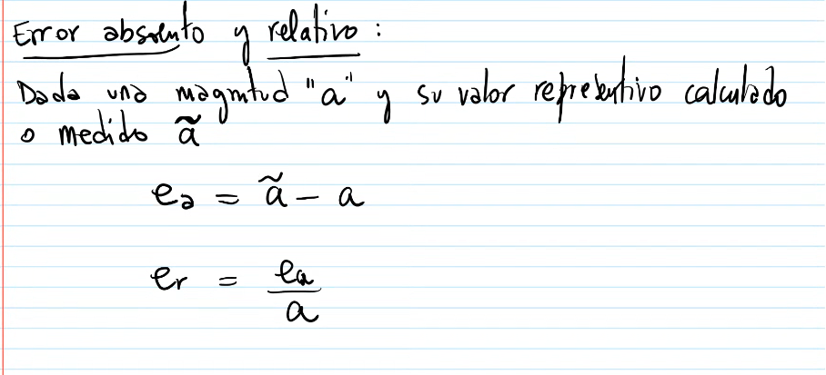
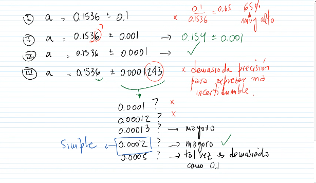
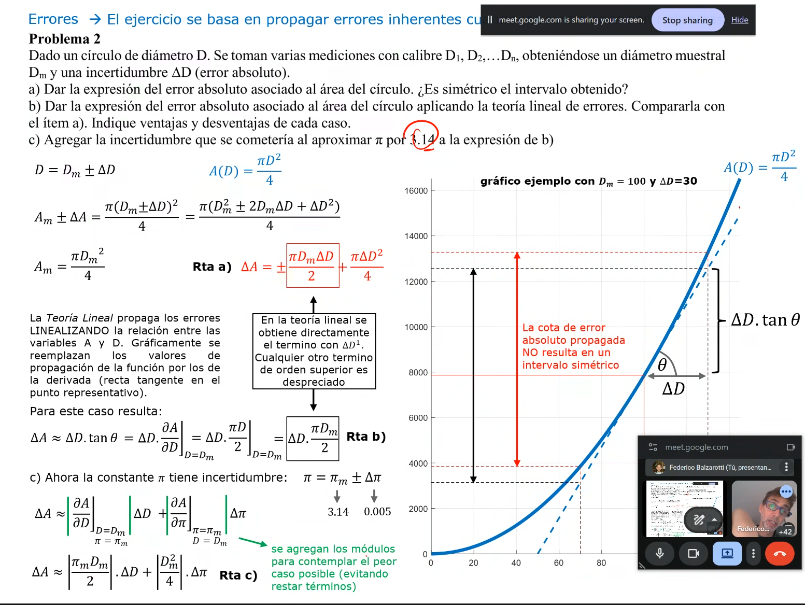

# Errores

## Error absoluto y relativo

Dada una magnitud $a$ y su valor representativo calculado o medido $\tilde{a}$:

$$
e_a = \tilde{a} - a
$$

$$
e_r = \frac{e_a}{a}
$$

#### Criterio más utilizado:

- Utilizar un digito para delta A
- Ubicar el digito en el a error afectado por la cota
- desechar los digitos de la derecha y aplicar redondeo simetrico al mas proximos

los errores tambien se propaga al realizar operaciones

#### Ejercicio:

Dado un circulo de diametro D. Se toman varias mediciones con calibre D1, D2, ... Dn. obteniendose un diametro muestral Dm y una incertidumbre {delta}D.
 a- Calcular el error absoluto y relativo asociado al area del circulo.
b- Dar la expresion del error absoluto asociado al area del circulo aplicando la teoria lineal de errores. Comparar la con el item a) y discutir la diferencia entre ambos resultados.
c- Agregar la incertidumbre que se cometeria si se aproxima pi a 3.14 en la expresion del b)

### Resolución paso a paso

Sea el diámetro medido:

\[
D = D_m \pm \Delta D
\]

donde \(D_m\) es el valor muestral y \(\Delta D\) la incertidumbre absoluta.

1. **Función área**

\[
A(D)=\frac{\pi D^2}{4}
\]

2. **Valor representativo del área**

\[
A_m=A(D_m)=\frac{\pi D_m^2}{4}
\]

### Item a) Error por extremos (sin linealizar)

Evaluando en los extremos \(D_m\pm\Delta D\):

\[
A(D_m+\Delta D)-A_m
=\frac{\pi}{2}D_m\Delta D+\frac{\pi}{4}(\Delta D)^2
\]

\[
A_m-A(D_m-\Delta D)
=\frac{\pi}{2}D_m\Delta D-\frac{\pi}{4}(\Delta D)^2
\]

Entonces, el intervalo queda:

\[
A \in \left[A_m-\left(\frac{\pi}{2}D_m\Delta D-\frac{\pi}{4}(\Delta D)^2\right),
\;A_m+\left(\frac{\pi}{2}D_m\Delta D+\frac{\pi}{4}(\Delta D)^2\right)\right]
\]

**Comentario aclaratorio:** el intervalo **no es simétrico** por el término cuadrático \((\Delta D)^2\).

### Item b) Teoría lineal de errores

Linealizando alrededor de \(D_m\):

\[
\Delta A_{\text{lin}}\approx \left|\frac{\partial A}{\partial D}\right|_{D_m}\Delta D
=\left|\frac{\pi D}{2}\right|_{D=D_m}\Delta D
=\frac{\pi D_m}{2}\,\Delta D
\]

Error relativo lineal:

\[
e_r(A)\approx \frac{\Delta A_{\text{lin}}}{A_m}
=\frac{\frac{\pi D_m}{2}\Delta D}{\frac{\pi D_m^2}{4}}
=2\frac{\Delta D}{D_m}
\]

**Comentario aclaratorio:** coincide con la imagen; en teoría lineal se descarta \((\Delta D)^2\), por eso da un error simétrico \(\pm\Delta A_{\text{lin}}\).

### Item c) Agregar incertidumbre por aproximar \(\pi\)

Ahora \(A\) depende de \(D\) y de \(\pi\):

\[
A(D,\pi)=\frac{\pi D^2}{4}
\]

Propagación lineal con dos variables:

\[
\Delta A\approx
\left|\frac{\partial A}{\partial D}\right|_{D=D_m,\,\pi=\pi_m}\Delta D
+
\left|\frac{\partial A}{\partial \pi}\right|_{D=D_m}\Delta \pi
\]

\[
\Delta A\approx
\left|\frac{\pi_m D_m}{2}\right|\Delta D
+
\left|\frac{D_m^2}{4}\right|\Delta \pi
\]

Si tomás \(\pi_m=3.14\), entonces \(\Delta \pi=|\pi-3.14|\approx 0.00159\).

**Comentario aclaratorio:** en muchos apuntes se redondea \(\Delta\pi\) por criterio de cotas (por ejemplo a un solo dígito significativo), por eso puede aparecer \(0.005\) en lugar de \(0.00159\).

### Funciones y derivadas utilizadas

- Función principal: \(A(D)=\frac{\pi D^2}{4}\)
- Función en dos variables: \(A(D,\pi)=\frac{\pi D^2}{4}\)
- Derivada respecto de \(D\): \(\frac{\partial A}{\partial D}=\frac{\pi D}{2}\)
- Derivada respecto de \(\pi\): \(\frac{\partial A}{\partial \pi}=\frac{D^2}{4}\)

