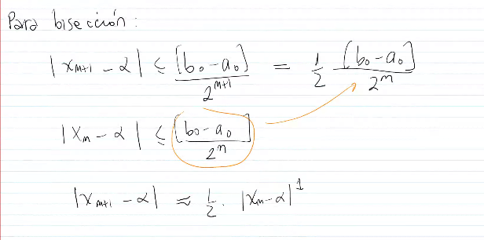
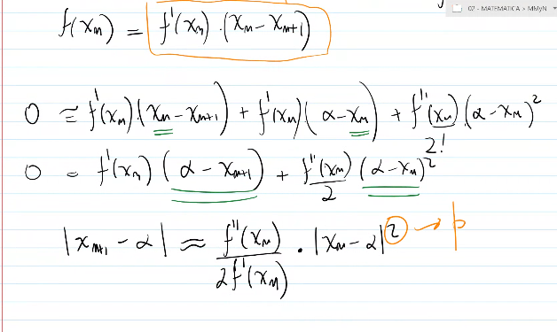
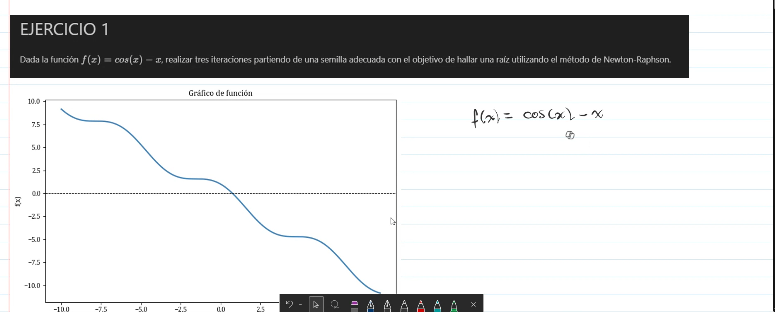

# Orden de Convergencia

Orden de convergencia: mide que tan rápido una sucesion iterativa se aproxima a su solucion. Se define como:
$$\lim_{n \to \infty} \frac{|x_{n+1} - x^*|}{|x_n - x^*|^p} = \lambda $$
donde $p$ es el orden de convergencia y $\lambda$ es una constante positiva. Si $p=1$, la convergencia es lineal; si $p=2$, es cuadrática; y así sucesivamente. Un orden de convergencia más alto indica una aproximación más rápida a la solución.

$$|x_{n+1} - \alpha| \approx \lambda |x_n - \alpha|^p$$

donde $\lambda, p \in \mathbb{R}$, con $\lambda > 0$ y $p > 0$.
¿ Que valores seran deseables para $p$ y $\lambda$?

- $p$ grande (mayor orden de convergencia)
- $\lambda$ pequeño (menor error en cada iteracion)

#### Para biseccion

#### Para Newton-Raphson

Aproximacion por Taylor de orden 2 tomando xn como punto de referencia:
$$f(x) = f(x_n) + f'(x_n)(x - x_n) + \frac{f''(x_n)}{2}(x - x_n)^2 + \ldots$$
Si $x$ es una raiz de $f$, entonces $f(x) = 0$ y despejando $x$ se obtiene la formula de Newton-Raphson:
$$x = x_n - \frac{f(x_n)}{f'(x_n)} - \frac{f''(x_n)}{2f'(x_n)}(x - x_n)^2 + \ldots$$
Si se desprecia el termino cuadratico, se obtiene la formula de Newton-Raphson:
$$x_{nr} = x_n - \frac{f(x_n)}{f'(x_n)}$$

$$|x_{n+1} - \alpha| = \left|\frac{f''(\alpha)}{2f'(x_n)}\right| |x_n - \alpha|^2$$

##### Practica

- Newton Raphson:
    $$ x_{k+1} = x_k - \frac{f(x_k)}{f'(x_k)} $$
- Secante:
    $$ x_{k+1} = x_k - f(x_k) \cdot \frac{x_k - x_{k-1}}{f(x_k) - f(x_{k-1})} $$
- Biseccion:
    $$ x_{k+1} = \frac{a_k + b_k}{2} $$

**Ejercicio 1**

**Funcion**: $f(x) = cos(x) - x$ con $x_0 = 0.5$.
**Derivada**: $f'(x) = -sin(x) - 1$

| $n$ | $x_n$ | $f(x_n)$ | $f'(x_n)$ | $x_{n+1}$ | Error |
|-----|-------|----------|-----------|-----------|-------|
| 0 | 0.50000 | 0.37758 | −1.47943 | 0.73909 | — |
| 1 | 0.73909 | 0.00590 | −1.67362 | 0.73909 | | 0.00000% |
Raíz aproximada: $x_r \approx 0.73909$
