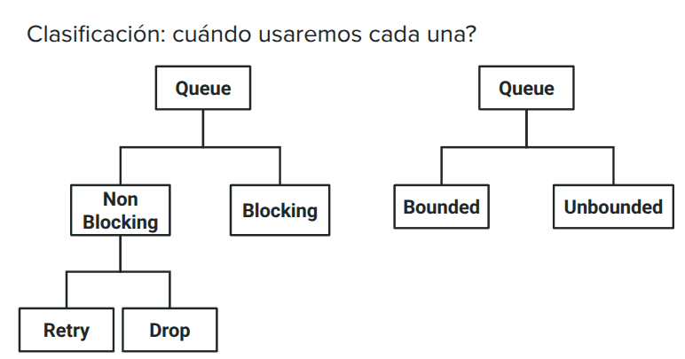

# Threads

## Que es un hilo?

Un hilo es una unidad de ejecución dentro de un proceso. Un proceso puede contener múltiples hilos que comparten el mismo espacio de memoria, lo que permite una comunicación más eficiente entre ellos. Los hilos pueden ejecutarse concurrentemente, lo que significa que pueden realizar tareas al mismo tiempo.

### Multithreading

Hay un hilo fetcher y un hilo parser. El hilo fetcher se encarga de obtener los datos de una fuente externa, como una API o una base de datos, mientras que el hilo parser se encarga de procesar esos datos y extraer la información relevante.

## Queues

Son la estructura de datos para poder comunicar hilos entre sí. Permiten que un hilo coloque datos en la cola y otro hilo los recupere de manera segura, evitando problemas de concurrencia.

Implementacion de una cola en C++ para comunicar hilos:

```C++
#include <queue>
#include <mutex>
// Este código es solo un ejemplo, no es una implementación completa de una cola bloqueante.
template<typename T> class BlockingQueue {
private:
    std::queue<T> queue;
    std::mutex mutex;
    std::condition_variable cv_is_not_empty;
public:
    void push(T&& element) { ...}
    T pop() {
        std::unique_lock<std::mutex> lock(mutex);
        while (queue.empty()) // mientras no se cumpla, espero!
           cv_is_not_empty.wait(lock); // lock.unlock(); block_until_notify(); lock.lock()
    }
    T element = std::move(internal.front());
    queue.pop();
    return element;
}

// Ejemplo de uso:
template<typename T> class BlockingQueue {
private:
    std::queue<T> queue;
    std::mutex mutex;
    std::condition_variable cv_is_not_empty;
public:
    void push(T&& element) {
        std::unique_lock<std::mutex> lock(mutex); // unique_lock implementa unlock()
        queue.push_back(std::move(element));
        cv_is_not_empty.notify_all(); // se cumple la condición, aviso a todos!
    }
    T pop() { ... }
};
```

En la documentacion de C++ se pueden encontrar implementaciones de colas bloqueantes, como `std::queue` junto con `std::mutex` y `std::condition_variable` para manejar la sincronización entre hilos. Se recomienda siempre utilizar notify_all() en lugar de notify_one() para evitar problemas de sincronización, especialmente cuando hay múltiples hilos esperando en la cola.

Para no quedarte sin memoria pusheando ilimitadamente (producis mas de lo que consumis) se puede implementar un while que limite la cantidad de elementos en la cola, por ejemplo:

```C++
void push(T&& element) {
    std::unique_lock<std::mutex> lock(mutex);
    while (queue.full()) // mientras no se cumpla, espero!
        cv_is_not_full.wait(lock); // lock.unlock(); block_until_notify(); lock.lock()
    queue.push_back(std::move(element));
    cv_is_not_empty.notify_all(); // se cumple la condición, aviso a todos!
}
```

Para cerrar una queue y evitar que los hilos queden bloqueados esperando por elementos que nunca llegarán, se puede implementar un método `close()` que marque la cola como cerrada y notifique a todos los hilos esperando:

```C++
void close() {
    std::unique_lock<std::mutex> lock(mutex);
    is_closed = true;
    cv_is_not_empty.notify_all();
}
T pop() {
    std::unique_lock<std::mutex> lock(mutex);
    while (queue.empty()) {
        if (is_closed) { throw QueueClosedException(); }
        cv_is_not_empty.wait(lock);
    }
    T element = std::move(queue.front());
    queue.pop();
    cv_is_not_full.notify_all();
    return element;
}
```



La diferencia entre un push bloqueante y uno no bloqueante es que el primero espera a que haya espacio en la cola para agregar un nuevo elemento, mientras que el segundo simplemente devuelve un error o una señal si la cola está llena. De manera similar, un pop bloqueante(pop) espera a que haya elementos disponibles en la cola para recuperar, mientras que un pop(trypop) no bloqueante devuelve un error o una señal si la cola está vacía.
